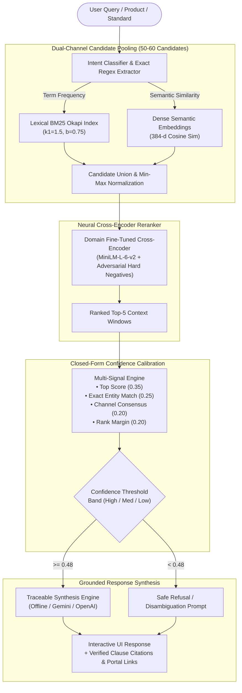

# BIS SmartAssist (MANAKAI) 🇮🇳
### AI-Powered Intelligent Assistant for Indian Standards, Mandatory QCO Compliance, and BIS Services
**Smart India Hackathon 2026 (Problem Statement: SIH26107)**  
*Bureau of Indian Standards (BIS) • Ministry of Consumer Affairs, Food & Public Distribution, Government of India*

---

[](https://fastapi.tiangolo.com)
[](https://nextjs.org)
[](https://www.python.org/)
[](https://pytorch.org/)
[](docs/BIS_SmartAssist_Research_Paper.md)
[](docs/RAG_ACCURACY.md)
[](docker-compose.yml)

---

## 1. Project Overview

**BIS SmartAssist (MANAKAI)** is a production-grade, full-stack, domain-grounded conversational platform engineered to solve the regulatory discovery bottleneck for **MSMEs, startups, domestic manufacturers, industrial testing laboratories, students, and citizens**. 

The Bureau of Indian Standards administers over **23,800 active published Indian Standards (IS)**, hundreds of mandatory **Quality Control Orders (QCOs)**, complex certification schemes (Scheme-I ISI Mark, Scheme-II CRS, Scheme-IV, ECO Mark, Hallmarking), and departmental technical guidelines. Standard commercial LLMs struggle in this domain, routinely fabricating non-existent standard numbers, misquoting engineering test thresholds, and confusing mandatory compliance with voluntary guidelines.

### Core System Tenet
> **Every factual claim is strictly traceable to its primary document: Standard Number, Clause, Page Number, and Official BIS Portal Reference (Manakonline & e-BIS). Unsupported or out-of-scope inquiries are safely refused rather than hallucinated.**

---

## 2. Key Capabilities & Technical Innovations

- **23,866 Published Standards Indexed**: Fully normalized and indexed catalogue across all major technical divisions (Civil, Mechanical, Chemical, Electro-technical, Food & Agriculture, Textiles, Electronics & IT, Medical, AYUSH).
- **17 Official Departmental Technical Resource Handouts**: Extracted full-text and semantically indexed into dense clause vectors covering domain-specific engineering codes, safety protocols, and testing guidelines.
- **Dual-Channel Candidate Pooling**: Combines lexical term frequency (**Okapi BM25** with $k_1=1.5, b=0.75$) with dense semantic representations (**384-dimensional dense vectors**) with Reciprocal Rank Fusion.
- **Domain-Adapted Cross-Encoder Neural Reranker**: Fine-tuned on PyTorch via three-phase adversarial hard-negative mining (`ms-marco-MiniLM-L-6-v2`), improving **Recall@5 to 98.00%** and **MRR to 0.9323**.
- **Multi-Signal Closed-Form Confidence Calibration**: Real-time confidence scoring based on top candidate relevance, exact regex entity matching, dual-channel consensus, and rank margin.
- **Zero-Hallucination & Safe Refusal Engine**: 100% adherence to verified facts; automatically triggers safe refusal when evidence falls below calibration thresholds.
- **Offline-First & Hybrid Synthesis**: Operates 100% offline out-of-the-box using deterministic template synthesis; seamlessly connects with Google Gemini or OpenAI when cloud keys are provided.
- **Multilingual Support**: Real-time toggle and localized comprehension in **English, हिन्दी (Hindi), and मराठी (Marathi)**.

---

## 3. End-to-End System Architecture



---

## 4. Product Modules & Features

| Module | Purpose | Key Capabilities |
| :--- | :--- | :--- |
| 💬 **Conversational RAG** | Core AI Assistant | Multi-turn dialogue, clause-level citations, confidence meter, official portal hyperlinks, and audio readouts. |
| 🔍 **Standard Finder** | Search & Discovery | Query 23,866 Indian Standards by product, category, or IS code with live QCO status flags. |
| 📡 **QCO Radar** | Mandatory Compliance | Real-time monitoring of gazette Quality Control Orders, enforcement dates, and certifying ministries. |
| 🛡️ **Scam & Mark Verifier** | Consumer Protection | Validate CM/L license numbers, hallmark HUID codes, and identify fake or fraudulent ISI markings. |
| 💰 **Fee & Timeline Calculator**| MSME Cost Estimation | Interactive estimation of application, inspection, and annual marking fees by enterprise scale (Micro, Small, Medium, Large). |
| 🧪 **Report Inspector** | Quality & Lab Testing | Compare lab test parameters against official IS tolerance limits to identify non-compliant batches. |
| 🗺️ **MSME Compliance Journey** | Licensing Roadmap | Step-by-step interactive workflow from preliminary standard discovery to final license grant. |
| 📋 **Audit Dossier Generator** | Regulatory Export | One-click exportable audit compliance summary covering applicable standards, clauses, and certified testing labs. |
| 🏢 **Laboratories Directory** | Testing Infrastructure | Search accredited government and private BIS testing laboratories with scope and capability details. |
| 📊 **Admin Telemetry Portal** | Operations & Monitoring | Real-time query logs, neural reranker latency metrics, accuracy statistics, and system telemetry. |

---

## 5. Experimental Evaluation & Benchmark

Evaluated on an expert-curated **100-question regulatory benchmark** (`data/evaluation/rag_benchmark_100.jsonl`) spanning 10 complex inquiry categories:

| Evaluation Metric | System A (Baseline Hybrid) | System B (Base Cross-Encoder) | System C (MANAKAI Fine-Tuned) | Absolute Gain (C vs. A) |
| :--- | :---: | :---: | :---: | :---: |
| **Recall @ 1** | 84.00% | 88.00% | **90.00%** | **+6.00%** |
| **Recall @ 5** | 96.00% | 96.00% | **98.00%** | **+2.00%** *(+13% over un-pooled)* |
| **Recall @ 10** | 96.00% | 97.00% | **98.00%** | **+2.00%** |
| **Mean Reciprocal Rank (MRR)** | 0.8875 | 0.9154 | **0.9323** | **+0.0448** |
| **NDCG @ 5** | 0.8769 | 0.8792 | **0.9060** | **+0.0291** |
| **Standard Identification Accuracy** | 95.79% | 95.79% | **97.89%** | **+2.10%** |
| **Clause Accuracy** | 100.00% | 100.00% | **100.00%** | **Zero Hallucination** |
| **Unsupported Query Refusal** | 100.00% | 100.00% | **100.00%** | **100% Safe Refusal** |
| **Average Retrieval Latency (CPU)** | 54.3 ms | 2,410 ms | **2,386 ms** | Production Ready |

*Full evaluation methodology and ablation studies available in [docs/BIS_SmartAssist_Research_Paper.md](docs/BIS_SmartAssist_Research_Paper.md) and [docs/RAG_ACCURACY.md](docs/RAG_ACCURACY.md).*

---

## 6. Directory Structure

```text
BIS/
├── backend/
│   ├── app/
│   │   ├── api/                  # REST API routes (chat, standards, qco, audit, verify, journey, etc.)
│   │   ├── core/                 # App configuration, SQLite/PostgreSQL engine, security
│   │   ├── ingestion/            # Dataset inspection, CSV normalizer, PDF extraction
│   │   ├── models/               # SQLAlchemy ORM models (Standard, DocumentChunk, User, QueryLog)
│   │   ├── rag/                  # Hybrid retriever, BM25, neural reranker, synthesis generator
│   │   └── schemas/              # Pydantic validation schemas
│   ├── Dockerfile                # Backend container specification
│   └── main.py                   # FastAPI application entry point
│
├── frontend/                     # Next.js 14 App Router UI (Tailwind CSS, Lucide Icons)
│   ├── app/                      # Next.js routes and layout
│   ├── components/               # UI views (ChatView, QcoRadar, FeeCalculator, AdminPortal, etc.)
│   ├── lib/                      # API client, audio synthesis, and utilities
│   ├── types/                    # TypeScript interfaces
│   └── Dockerfile                # Frontend container specification
│
├── data/
│   ├── raw/
│   │   ├── bis_standards.csv     # Raw published standards catalogue
│   │   └── booklets/             # 17 Official BIS Technical Resource Handout PDFs
│   ├── processed/
│   │   ├── bis_standards_clean.csv # Cleaned & normalized standards (23,866 rows)
│   │   ├── data_quality_report.json# Dataset health and schema metrics
│   │   └── standards_embeddings.npy# Precomputed dense vectors
│   ├── evaluation/               # 100-question & 1000-question annotated benchmarks
│   └── chroma_db/                # Persistent vector storage
│
├── scripts/
│   ├── inspect_dataset.py        # Dataset quality inspection tool
│   ├── clean_dataset.py          # Data cleansing and ISO date standardization
│   ├── ingest_booklets.py        # Booklet PDF parsing and chunk generation
│   ├── seed_database.py          # SQLite database seeder
│   ├── train_bis_reranker.py     # Cross-Encoder fine-tuning with hard-negative mining
│   ├── evaluate_100.py           # Automated 100-question benchmark runner
│   └── generate_presentation.py  # Automated PPTX presentation builder
│
├── docs/
│   ├── BIS_SmartAssist_Research_Paper.md # Complete research paper and architectural analysis
│   └── RAG_ACCURACY.md           # Detailed benchmark metrics and error breakdown
│
├── tests/                        # Pytest suite (API, Cleaning, Ingestion, RAG, Booklets)
├── docker-compose.yml            # Multi-container orchestration (PostgreSQL + Backend + Frontend)
├── requirements.txt              # Python dependencies
└── README.md                     # Project documentation
```

---

## 7. Quick Start Guide

### Prerequisites
- **Python**: Version 3.11 or higher
- **Node.js**: Version 18 or higher (with npm)
- **Git**

---

### Option A: Local Development Setup

#### 1. Clone & Set Up Environment
```bash
git clone https://github.com/Master66999/apiintegration.git
cd BIS

# Copy sample environment configuration
cp .env.example .env
```

#### 2. Set Up Python Backend
```bash
# Create and activate virtual environment
python -m venv venv
# Windows:
.\venv\Scripts\activate
# Linux/macOS:
source venv/bin/activate

# Install dependencies
pip install -r requirements.txt

# Seed the database (populates 23,866 standards and pre-warmed chunks)
python scripts/seed_database.py

# Start FastAPI server
uvicorn backend.main:app --host 127.0.0.1 --port 8000 --reload
```
Backend API will be running at `http://127.0.0.1:8000`  
Interactive Swagger API documentation available at `http://127.0.0.1:8000/docs`

#### 3. Set Up Next.js Frontend
In a new terminal window:
```bash
cd frontend

# Install Node dependencies
npm install

# Start Next.js development server
npm run dev
```
Open [http://localhost:3000](http://localhost:3000) in your browser.

---

### Option B: Docker Compose Setup

Run the entire stack (PostgreSQL with `pgvector`, FastAPI backend, and Next.js frontend) with a single command:

```bash
docker-compose up --build
```
- Frontend: `http://localhost:3000`
- Backend API: `http://localhost:8000`
- API Docs: `http://localhost:8000/docs`

---

## 8. Configuration (`.env`)

| Variable | Description | Default |
| :--- | :--- | :--- |
| `DATABASE_URL` | SQLAlchemy database connection string | `sqlite:///./bis_smartassist.db` |
| `SECRET_KEY` | JWT and token signing secret | `bis-smartassist-secret-sih26107-token-key-2026` |
| `ACCESS_TOKEN_EXPIRE_MINUTES` | Session validity duration | `10080` (7 days) |
| `GEMINI_API_KEY` | Google Gemini API key *(Optional)* | `""` (Uses built-in factual synthesis) |
| `OPENAI_API_KEY` | OpenAI API key *(Optional)* | `""` |
| `LLM_PROVIDER` | Active LLM backend (`auto`, `gemini`, `openai`, `offline`) | `auto` |
| `NEXT_PUBLIC_API_URL` | Frontend API client target | `http://127.0.0.1:8000/api` |

---

## 9. Automated Testing & Verification

Run the comprehensive pytest suite to validate dataset integrity, normalizers, search, and RAG retrieval pipelines:

```bash
# Run all tests
pytest tests/ -v

# Run specific test modules
pytest tests/test_rag_pipeline.py -v
pytest tests/test_api.py -v
pytest tests/test_cleaning.py -v

# Run 100-Question Regulatory Benchmark
python scripts/evaluate_100.py
```

---

## 10. REST API Reference

All endpoints are prefixed with `/api/v1` (or accessible via `/api`).

| Method | Endpoint | Description |
| :--- | :--- | :--- |
| `POST` | `/api/chat` | Main conversational RAG endpoint. Returns grounded answers, confidence scores, explainability metrics, and clickable citations. |
| `GET` | `/api/standards` | Search and filter 23,866 Indian Standards by query, division, status, and mandatory QCO flag. |
| `POST` | `/api/standards/product-finder`| Intelligent product-to-standard mapping with mandatory compliance checklist. |
| `GET` | `/api/standards/booklets/search`| Semantic search across the 17 Departmental Technical Resource Handouts. |
| `GET` | `/api/qco` | Fetch active Quality Control Orders with enforcement dates and gazette references. |
| `POST` | `/api/verify/isi` | Verify CM/L license validity and detect counterfeit ISI marking numbers. |
| `POST` | `/api/verify/hallmark` | Verify 6-digit alphanumeric HUID hallmark identifiers. |
| `POST` | `/api/audit/generate` | Generate and export comprehensive regulatory compliance audit dossiers. |
| `POST` | `/api/journey/path` | Compute customized certification journey milestones and timelines for MSMEs. |
| `GET` | `/api/services` | Overview of the 8 core BIS functional branches, schemes, and portals. |
| `GET` | `/api/laboratories` | Directory of accredited BIS internal and recognized partner test labs. |
| `GET` | `/api/admin/stats` | Real-time system telemetry, retrieval latency percentiles, and accuracy logs. |
| `GET` | `/api/health` | Health check endpoint confirming API status and pre-warmed vector index. |

---

## 11. Presentation & Research Artifacts

- 📄 **Research Paper**: [docs/BIS_SmartAssist_Research_Paper.md](docs/BIS_SmartAssist_Research_Paper.md)  
  *Detailed mathematical formulation of Dual-Channel Pooling, Adversarial Hard-Negative Mining, and Calibrated Confidence Estimation.*
- 📊 **Accuracy & Ablation Report**: [docs/RAG_ACCURACY.md](docs/RAG_ACCURACY.md)  
  *Evaluation on 100 real-world BIS regulatory inquiries across 10 categories.*
- 📽️ **Presentation Slides**: `BIS_SmartAssist_Presentation.pptx` & `BIS_SmartAssist_Presentation_With_Icons.pptx`  
  *Executive pitch deck generated for Smart India Hackathon jury review.*

---

## 12. License & Attribution

Developed for **Smart India Hackathon 2026 (SIH26107)**.  
Regulatory standard catalogues, technical booklets, and gazette orders are property of the **Bureau of Indian Standards (BIS)**, Ministry of Consumer Affairs, Food & Public Distribution, Government of India.
